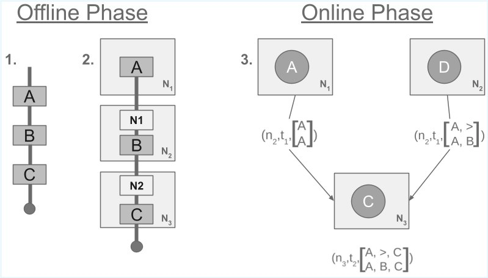

# Edge-Native Process Insights

This repository sketches a distributed conformance checking algorithm using alignments.

The algorithm deals with multiple nodes having partial data. To gain global process insights (the conformance 
values) a protocol is implemented to share the current alignment states. The process model is encoded with a trie data
structure.

